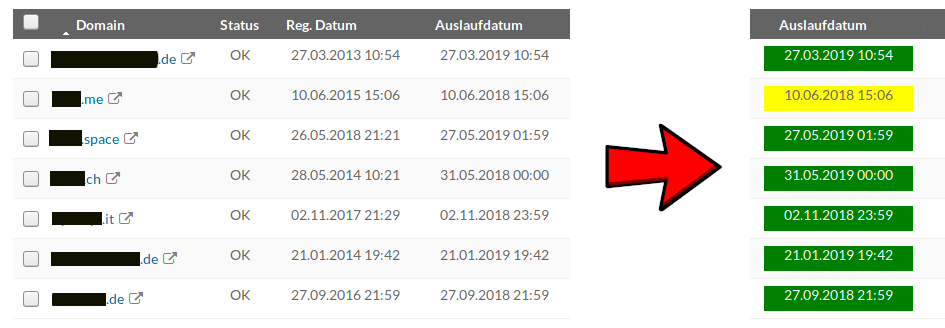

# Domain Expirationdate Colorizer
This is a Firefox Addon which changes the color of the expirationdate on the webinterface of your registrar.

## Already implemented domain registrars
  * [INWX](https://www.inwx.de)

## Limits
The limits are as follows

  * less than 2 weeks: Red
  * less than 6 weeks: Yellow
  * more than 6 weeks: Green

## Firefox Addon
The addon can be found [here](https://addons.mozilla.org/en-US/firefox/addon/expirationdate-colorizer/)